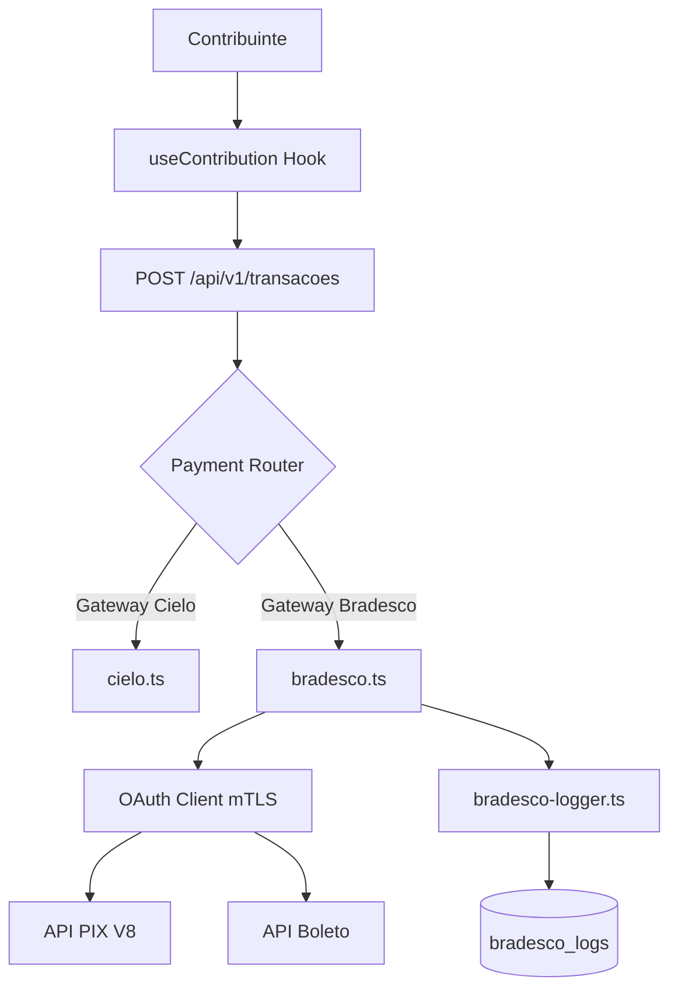
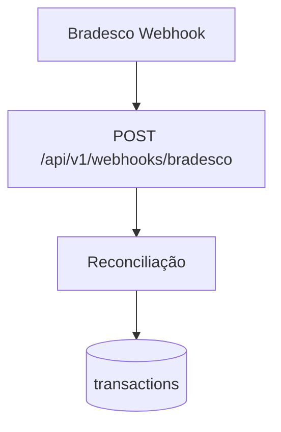
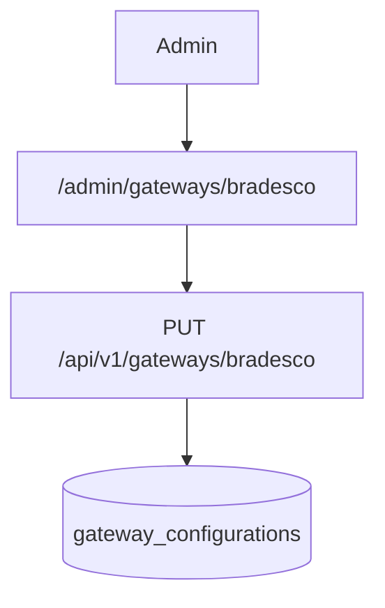

# Design: Integração Gateway Bradesco (PIX + Boleto)

## Visão Geral

Implementação de um módulo de integração direta com as APIs do Bradesco para PIX (API PIX Recebimento V8 — padrão BACEN) e Boleto Registrado. O módulo segue o mesmo padrão arquitetural da integração Cielo existente: arquivo lib dedicado, logger próprio, cache de configuração, e webhook handler independente.

O admin escolhe qual gateway ativar (Cielo ou Bradesco) — apenas um fica ativo por vez. Um Payment Router na camada de API direciona pagamentos para o gateway correto.

## Arquitetura

### Fluxo de Pagamento



### Fluxo de Webhook



### Fluxo de Configuração



## Componentes e Interfaces

### 1. OAuth Client (`src/lib/bradesco.ts` — interno)

Responsável por autenticação OAuth2 com mTLS. O token é cacheado em memória com TTL baseado no `expires_in` da resposta.

```typescript
interface BradescoOAuthToken {
  accessToken: string
  expiresAt: number // timestamp em ms
}

interface BradescoConfig {
  clientId: string
  clientSecret: string
  certificate: string // conteúdo base64 do .pfx/.pem
  certificatePassword: string
  environment: 'production' | 'development'
}
```

Endpoints de autenticação:

- Sandbox: `https://proxy.api.prebanco.com.br/auth/server/v1.2/token`
- Produção: `https://openapi.bradesco.com.br/auth/server/v1.2/token`

O mTLS é feito passando o certificado digital (.pfx/.pem) na requisição HTTPS via `https.Agent` do Node.js (não compatível com Edge Runtime — a rota API roda em Node.js runtime).

### 2. PIX Service (`src/lib/bradesco.ts`)

Segue a especificação BACEN para API PIX Recebimento. Endpoints:

```typescript
// Criar cobrança imediata
async function createBradescoPixPayment(
  amount: number, // em reais (convertido para "0.00" string)
  pixKey: string, // chave PIX do recebedor
  customerName: string,
  customerCpf: string,
): Promise<BradescoPixResponse>

// Consultar cobrança por txid
async function queryBradescoPixPayment(txid: string): Promise<BradescoPixQueryResponse>

interface BradescoPixResponse {
  txid: string
  location: string // URL para gerar QR Code
  qrCode: string // payload copia-e-cola
  qrCodeBase64Image: string // imagem base64 do QR Code
  status: 'ATIVA' | 'CONCLUIDA' | 'REMOVIDA_PELO_USUARIO_RECEBEDOR' | 'REMOVIDA_PELO_PSP'
}

interface BradescoPixQueryResponse {
  txid: string
  status: 'ATIVA' | 'CONCLUIDA' | 'REMOVIDA_PELO_USUARIO_RECEBEDOR' | 'REMOVIDA_PELO_PSP'
  valor: { original: string }
  pix?: Array<{
    endToEndId: string
    valor: string
    horario: string
  }>
}
```

Endpoints PIX (padrão BACEN):

- Sandbox: `https://proxy.api.prebanco.com.br/v1/pix/cob/{txid}`
- Produção: `https://openapi.bradesco.com.br/v1/pix/cob/{txid}`

O `txid` é gerado pelo sistema (26-35 caracteres alfanuméricos, sem hífens) para garantir idempotência.

### 3. Boleto Service (`src/lib/bradesco.ts`)

```typescript
async function createBradescoBoletoPayment(
  amount: number, // em reais
  customerName: string,
  customerCpf: string,
  customerAddress: string,
  customerCity: string,
  customerState: string,
  customerZipCode: string,
  customerDistrict: string,
): Promise<BradescoBoletoResponse>

async function queryBradescoBoletoPayment(nossoNumero: string): Promise<BradescoBoletoQueryResponse>

interface BradescoBoletoResponse {
  nossoNumero: string
  linhaDigitavel: string
  codigoBarras: string
  url: string // URL para visualização do boleto
}

interface BradescoBoletoQueryResponse {
  nossoNumero: string
  status: 'registrado' | 'pago' | 'vencido' | 'cancelado'
  valorPago?: number
  dataPagamento?: string
}
```

Endpoints Boleto:

- Sandbox: `https://proxy.api.prebanco.com.br/v1/boleto/registrar`
- Produção: `https://openapi.bradesco.com.br/v1/boleto/registrar`

### 4. Bradesco Logger (`src/lib/bradesco-logger.ts`)

Análogo ao `cielo-logger.ts`. Registra requisições, respostas e webhooks na tabela `bradesco_logs`.

```typescript
async function logBradescoRequest(data: {
  operationType: 'pix' | 'boleto' | 'consulta' | 'token'
  method: string
  endpoint: string
  paymentId?: string
  requestBody?: unknown
}): Promise<void>

async function logBradescoResponse(data: {
  operationType: 'pix' | 'boleto' | 'consulta' | 'token'
  method: string
  endpoint: string
  paymentId?: string
  responseBody?: unknown
  statusCode: number
  errorMessage?: string
}): Promise<void>

async function logBradescoWebhook(data: { paymentId?: string; requestBody: unknown }): Promise<void>
```

### 5. Payment Router (dentro de `src/app/api/v1/transacoes/route.ts`)

Lógica adicionada à rota de transações existente para verificar qual gateway está ativo e direcionar o pagamento.

```typescript
async function getActiveGateway(): Promise<'Cielo' | 'Bradesco'>

// Dentro do POST handler:
// 1. Buscar gateway ativo
// 2. Se Bradesco + cartão de crédito → erro
// 3. Se Bradesco + PIX → createBradescoPixPayment()
// 4. Se Bradesco + boleto → createBradescoBoletoPayment()
// 5. Se Cielo → fluxo existente
```

### 6. Webhook Handler (`src/app/api/v1/webhooks/bradesco/route.ts`)

Endpoint público que recebe notificações do Bradesco.

```typescript
// PIX webhook payload (padrão BACEN)
interface BradescoPixWebhookPayload {
  pix: Array<{
    endToEndId: string
    txid: string
    valor: string
    horario: string
    infoPagador?: string
  }>
}

// Boleto webhook payload
interface BradescoBoletoWebhookPayload {
  nossoNumero: string
  status: string
  valorPago?: number
  dataPagamento?: string
}
```

## Modelos de Dados

### Tabela `bradesco_logs` (nova)

```sql
CREATE TABLE bradesco_logs (
  id UUID PRIMARY KEY DEFAULT gen_random_uuid(),
  operation_type VARCHAR(20) NOT NULL,  -- 'pix', 'boleto', 'consulta', 'token', 'webhook'
  type VARCHAR(10) NOT NULL,            -- 'request' ou 'response'
  method VARCHAR(10) NOT NULL,          -- 'GET', 'POST', 'PUT'
  endpoint TEXT NOT NULL,
  payment_id TEXT,                       -- txid (PIX) ou nossoNumero (boleto)
  request_body TEXT,
  response_body TEXT,
  status_code INTEGER,
  error_message TEXT,
  created_at TIMESTAMP DEFAULT NOW()
);
```

Schema Drizzle:

```typescript
export const bradescoLogs = pgTable('bradesco_logs', {
  id: uuid('id')
    .primaryKey()
    .default(sql`gen_random_uuid()`),
  operationType: varchar('operation_type', { length: 20 }).notNull(),
  type: varchar('type', { length: 10 }).notNull(),
  method: varchar('method', { length: 10 }).notNull(),
  endpoint: text('endpoint').notNull(),
  paymentId: text('payment_id'),
  requestBody: text('request_body'),
  responseBody: text('response_body'),
  statusCode: integer('status_code'),
  errorMessage: text('error_message'),
  createdAt: timestamp('created_at').defaultNow(),
})
```

### Alterações na tabela `transactions`

O campo `gatewayTransactionId` já armazena o identificador do gateway. Para o Bradesco:

- PIX: armazena o `txid`
- Boleto: armazena o `nossoNumero`

Adicionar campo `gateway` (varchar) para identificar qual gateway processou a transação, se não existir.

### Cache Keys (adição ao `config-cache.ts`)

```typescript
export const CACHE_KEYS = {
  // ... existentes
  BRADESCO_CONFIG: (companyId: string) => `bradesco:config:${companyId}`,
  BRADESCO_TOKEN: (companyId: string) => `bradesco:token:${companyId}`,
} as const
```

## Propriedades de Corretude

_Uma propriedade é uma característica ou comportamento que deve ser verdadeiro em todas as execuções válidas de um sistema — essencialmente, uma declaração formal sobre o que o sistema deve fazer. Propriedades servem como ponte entre especificações legíveis por humanos e garantias de corretude verificáveis por máquina._

Baseado na análise do prework, as seguintes propriedades foram identificadas após reflexão para eliminar redundâncias:

### Property 1: Cache de token OAuth respeita TTL

_Para qualquer_ valor de `expires_in` retornado pelo Bradesco, o OAuth_Client deve retornar o mesmo token em cache antes da expiração e solicitar um novo token após a expiração.

**Validates: Requirements 1.2, 1.3, 1.4**

### Property 2: Geração de txid/nossoNumero é única e válida

_Para qualquer_ sequência de N identificadores gerados (txid para PIX ou nossoNumero para boleto), todos devem ser únicos entre si e seguir o formato esperado (txid: 26-35 caracteres alfanuméricos; nossoNumero: numérico).

**Validates: Requirements 2.3, 4.3**

### Property 3: Payload PIX contém campos obrigatórios

_Para qualquer_ valor monetário positivo e dados de cliente válidos, o payload montado pelo PIX_Service deve conter os campos `valor.original` (string formatada com 2 decimais), `chave` (chave PIX do recebedor) e `devedor` (nome e CPF).

**Validates: Requirements 2.1**

### Property 4: Extração de resposta PIX preserva dados

_Para qualquer_ resposta válida da API PIX do Bradesco contendo txid, location e QR Code, o PIX_Service deve extrair e retornar todos esses campos sem perda de dados.

**Validates: Requirements 2.2**

### Property 5: Payload Boleto contém campos obrigatórios

_Para qualquer_ valor monetário positivo e dados completos do pagador (nome, CPF, endereço, cidade, estado, CEP), o payload montado pelo Boleto_Service deve conter todos os campos obrigatórios para registro no Bradesco.

**Validates: Requirements 4.1**

### Property 6: Extração de resposta Boleto preserva dados

_Para qualquer_ resposta válida da API de Boleto do Bradesco contendo nossoNumero, linhaDigitavel, codigoBarras e URL, o Boleto_Service deve extrair e retornar todos esses campos sem perda de dados.

**Validates: Requirements 4.2**

### Property 7: Erros de API geram exceções com mensagem pt-BR

_Para qualquer_ erro HTTP retornado pelas APIs do Bradesco (PIX, Boleto, OAuth), o serviço correspondente deve lançar uma exceção cuja mensagem está em português brasileiro e não contém dados sensíveis.

**Validates: Requirements 1.5, 2.4, 3.3, 4.4, 5.2**

### Property 8: Roteamento de pagamento é correto

_Para qualquer_ combinação de gateway ativo ("Cielo" ou "Bradesco") e método de pagamento ("pix", "boleto", "credit_card"), o Payment_Router deve direcionar para o serviço correto ou retornar erro quando a combinação não é suportada (Bradesco + cartão de crédito, nenhum gateway ativo).

**Validates: Requirements 7.2, 7.3, 7.4, 7.5, 7.6**

### Property 9: Logger sanitiza dados sensíveis

_Para qualquer_ payload contendo campos sensíveis (accessToken, clientSecret, certificate, certificatePassword), o Bradesco_Logger deve produzir um registro onde nenhum desses valores aparece em texto claro.

**Validates: Requirements 6.1, 6.2, 6.3, 6.4**

### Property 10: Webhook com payload válido atualiza status corretamente

_Para qualquer_ payload de webhook PIX válido (contendo array `pix` com `endToEndId`, `txid`, `valor`, `horario`) ou payload de webhook Boleto válido, o Webhook_Handler deve atualizar o status da transação correspondente para o valor correto.

**Validates: Requirements 8.1, 8.2**

### Property 11: Webhook com payload inválido retorna HTTP 200

_Para qualquer_ payload que não passa na validação Zod do webhook, o Webhook_Handler deve retornar status HTTP 200 (para evitar retentativas do Bradesco) e registrar o erro.

**Validates: Requirements 8.4**

## Tratamento de Erros

### Erros de Autenticação OAuth2

- Certificado inválido/expirado → exceção com mensagem descritiva, log detalhado
- Credenciais incorretas → exceção com mensagem pt-BR, sem expor credenciais no log
- Timeout na autenticação → exceção com sugestão de retry manual

### Erros de API PIX/Boleto

- HTTP 4xx → parsear mensagem de erro do Bradesco, traduzir para pt-BR quando possível
- HTTP 5xx → log do erro, exceção genérica sugerindo tentar novamente
- Timeout (15s) → AbortController aborta, exceção com mensagem de timeout
- Resposta não-JSON → log do corpo raw (truncado), exceção genérica

### Erros de Webhook

- Payload inválido → retornar HTTP 200 (evitar retry), logar erro
- Transação não encontrada → usar reconciliação com retry exponencial (até 5 tentativas)
- Erro de processamento → retornar HTTP 500 (Bradesco retenta)

### Padrão de Erro Consistente

Todas as funções exportadas do `bradesco.ts` lançam `Error` com mensagem em pt-BR. O chamador (rota API) captura e retorna `NextResponse.json({ error: message }, { status })`.

## Estratégia de Testes

### Testes Unitários

- Montagem de payloads PIX e Boleto com dados específicos
- Mapeamento de ambiente para URLs (sandbox vs produção)
- Parsing de respostas da API com exemplos reais
- Edge cases: valores zero, CPF inválido, campos vazios
- Tratamento de erros HTTP específicos (401, 403, 404, 500)

### Testes de Propriedade (Property-Based Testing)

- Biblioteca: `fast-check` (já disponível no ecossistema TypeScript/Next.js)
- Mínimo 100 iterações por propriedade
- Cada teste referencia a propriedade do design:
  - Tag format: **Feature: bradesco-gateway-integration, Property {N}: {título}**

As propriedades 1-11 acima devem ser implementadas como testes de propriedade usando `fast-check`, gerando inputs aleatórios para validar que as invariantes se mantêm em todos os casos.

### Testes de Integração

- Webhook handler end-to-end com payloads simulados
- Roteamento de pagamento com diferentes configurações de gateway
- Cache de configuração com invalidação

### Configuração de Runtime

As rotas API que usam mTLS (certificado digital) devem rodar em Node.js runtime (não Edge), configurado via `export const runtime = 'nodejs'` no arquivo de rota.
