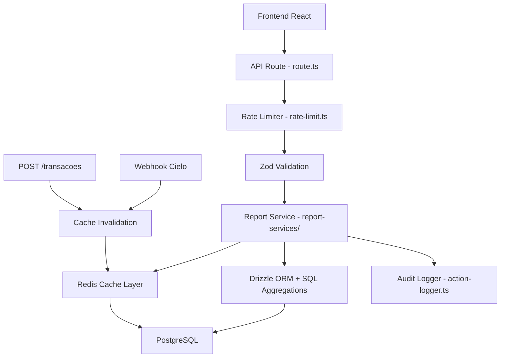

# Design: Melhorias no Sistema de Relatórios Financeiros

## Visão Geral

Este design detalha as melhorias no sistema de relatórios do Vinha Admin Center, focando em 8 áreas: validação de entrada (Zod), paginação server-side, otimização de cálculos para SQL, invalidação de cache, rate limiting, logs de auditoria, refatoração para camada de serviço e mensagens de erro detalhadas.

A abordagem é incremental — cada melhoria é aplicada sobre a estrutura existente das 6 APIs de relatórios, sem quebrar funcionalidades atuais.

## Arquitetura

### Arquitetura Atual

```
Frontend (React) → API Route (route.ts) → Drizzle ORM → PostgreSQL
                                        → Redis Cache (getCache/setCache)
```

### Arquitetura Proposta



A camada de API Route se torna fina: valida JWT, aplica rate limit, valida input com Zod, delega ao serviço, e formata a resposta HTTP. Toda a lógica de negócio fica nos serviços.

### Decisões de Design

1. **Reutilizar `src/lib/rate-limit.ts` existente** — já usa Redis, já é usado em transações. Apenas aplicar nos endpoints de relatórios.
2. **Reutilizar `src/lib/action-logger.ts` existente** — já insere em `user_action_logs`. Apenas chamar após gerar relatórios.
3. **Reutilizar `src/lib/cache.ts` existente** — `invalidateCache` já é chamado em webhooks e transações com padrão `relatorio:*`. Apenas garantir cobertura completa.
4. **Criar `src/lib/report-services/`** — nova pasta com um arquivo por tipo de relatório, extraindo lógica das routes.
5. **Schemas Zod compartilhados** — criar `src/lib/schemas/report-schemas.ts` com schemas reutilizáveis.

## Componentes e Interfaces

### 1. Schemas de Validação (`src/lib/schemas/report-schemas.ts`)

```typescript
import { z } from 'zod'

// Schema base para período
export const periodSchema = z
  .object({
    from: z.string().datetime().optional(),
    to: z.string().datetime().optional(),
  })
  .refine(
    (data) => {
      if (data.from && data.to) {
        return new Date(data.from) <= new Date(data.to)
      }
      return true
    },
    { message: 'Data inicial deve ser anterior à data final' },
  )
  .refine(
    (data) => {
      if (data.from && data.to) {
        const diff = new Date(data.to).getTime() - new Date(data.from).getTime()
        return diff <= 365 * 24 * 60 * 60 * 1000
      }
      return true
    },
    { message: 'Período máximo permitido é de 365 dias' },
  )

// Schema base para paginação
export const paginationSchema = z.object({
  page: z.coerce.number().int().min(1).default(1),
  limit: z.coerce.number().int().min(1).max(100).default(20),
})

// Schema para relatório financeiro
export const financialReportSchema = z.object({
  from: z.string().optional(),
  to: z.string().optional(),
  method: z.enum(['all', 'pix', 'credit_card', 'boleto']).default('all'),
  status: z.enum(['all', 'approved', 'pending', 'refused', 'refunded']).default('all'),
  page: z.coerce.number().int().min(1).default(1),
  limit: z.coerce.number().int().min(1).max(100).default(50),
})

// Schema para relatório de contribuições
export const contributionsReportSchema = z.object({
  from: z.string().optional(),
  to: z.string().optional(),
  contributorType: z.enum(['all', 'pastor', 'church_account']).default('all'),
  page: z.coerce.number().int().min(1).default(1),
  limit: z.coerce.number().int().min(1).max(100).default(20),
})

// Schema para relatório de membresia
export const membershipReportSchema = z.object({
  role: z
    .enum(['all', 'admin', 'manager', 'supervisor', 'pastor', 'church_account'])
    .default('all'),
  page: z.coerce.number().int().min(1).default(1),
  limit: z.coerce.number().int().min(1).max(100).default(20),
})

// Schema para relatório de inadimplentes
export const defaultersReportSchema = z.object({
  type: z.enum(['all', 'pastor', 'church']).default('all'),
  search: z.string().optional(),
  sortBy: z.enum(['daysLate', 'name']).default('daysLate'),
  sortOrder: z.enum(['asc', 'desc']).default('desc'),
  page: z.coerce.number().int().min(1).default(1),
  limit: z.coerce.number().int().min(1).max(100).default(20),
})

// Schema para relatório de igrejas
export const churchesReportSchema = z.object({
  from: z.string().optional(),
  to: z.string().optional(),
  supervisorId: z.string().uuid().optional(),
})

// Schema para relatório geral (POST)
export const generalReportSchema = z.object({
  reportType: z.enum(['fin-01', 'mem-01', 'ch-01', 'con-01', 'def-01']),
  startDate: z.string().optional(),
  endDate: z.string().optional(),
  paymentMethod: z.enum(['pix', 'credit_card', 'boleto']).optional(),
  paymentStatus: z.enum(['approved', 'pending', 'refused', 'refunded']).optional(),
})
```

### 2. Camada de Serviço (`src/lib/report-services/`)

Cada serviço segue a mesma interface:

```typescript
// src/lib/report-services/types.ts
export interface PaginationParams {
  page: number
  limit: number
}

export interface PaginationMeta {
  page: number
  limit: number
  total: number
  totalPages: number
  hasNext: boolean
  hasPrev: boolean
}

export interface PaginatedResult<T> {
  data: T[]
  pagination: PaginationMeta
}
```

Serviços planejados:

- `src/lib/report-services/financial-report.ts` — relatório financeiro
- `src/lib/report-services/contributions-report.ts` — relatório de contribuições
- `src/lib/report-services/membership-report.ts` — relatório de membresia
- `src/lib/report-services/defaulters-report.ts` — relatório de inadimplentes
- `src/lib/report-services/churches-report.ts` — relatório de igrejas
- `src/lib/report-services/general-report.ts` — relatório geral (5 sub-tipos)

### 3. Padrão de API Route Refatorada

Cada route segue este padrão:

```typescript
export async function GET(request: NextRequest) {
  // 1. Auth
  const { user } = await validateRequest()
  if (!user || user.role !== 'admin') {
    return NextResponse.json({ error: 'Não autorizado.' }, { status: 401 })
  }

  // 2. Rate limit
  const ip = request.headers.get('x-forwarded-for') || 'unknown'
  const rl = await rateLimit('relatorio-financeiro', ip, 30, 60)
  if (!rl.allowed) {
    return NextResponse.json(
      { error: 'Muitas requisições. Tente novamente em alguns minutos.' },
      { status: 429, headers: { 'Retry-After': '60' } },
    )
  }

  try {
    // 3. Validação Zod
    const params = Object.fromEntries(new URL(request.url).searchParams)
    const validated = financialReportSchema.parse(params)

    // 4. Delegar ao serviço
    const result = await generateFinancialReport(user.companyId, validated)

    // 5. Audit log (assíncrono, não bloqueia resposta)
    logUserAction(
      user.id,
      'generate_report',
      'report',
      'financeiro',
      JSON.stringify(validated),
    ).catch((err) => console.error('[AUDIT_LOG_ERROR]', err))

    return NextResponse.json(result)
  } catch (error) {
    if (error instanceof z.ZodError) {
      return NextResponse.json(
        { error: 'Parâmetros inválidos', detalhes: error.errors.map((e) => e.message) },
        { status: 400 },
      )
    }
    console.error('[RELATORIO_FINANCEIRO_ERROR]', error)
    return NextResponse.json(
      { error: 'Erro ao gerar relatório financeiro. Tente novamente.' },
      { status: 500 },
    )
  }
}
```

### 4. Paginação Server-Side

Exemplo de paginação no serviço de relatório financeiro:

```typescript
// Dentro do serviço
const offset = (params.page - 1) * params.limit

// Query com LIMIT/OFFSET
const transactionsData = await db
  .select({ ... })
  .from(transactions)
  .where(and(...conditions))
  .orderBy(desc(transactions.createdAt))
  .limit(params.limit)
  .offset(offset)

// Contagem total separada
const [{ count }] = await db
  .select({ count: sql<number>`COUNT(*)` })
  .from(transactions)
  .where(and(...conditions))

return {
  data: transactionsData,
  pagination: buildPaginationMeta(params.page, params.limit, Number(count)),
}
```

### 5. Otimização SQL para Inadimplentes

Substituir `getDaysSince()` em loop por cálculo SQL:

```typescript
// ANTES: getDaysSince(lastPaymentDate) em loop JavaScript
// DEPOIS: Cálculo direto no SQL
const defaultersQuery = db
  .select({
    id: users.id,
    name: sql<string>`CONCAT(${pastorProfiles.firstName}, ' ', ${pastorProfiles.lastName})`,
    lastPayment: sql<Date>`MAX(${transactions.createdAt})`,
    daysLate: sql<number>`EXTRACT(DAY FROM NOW() - MAX(${transactions.createdAt}))`,
  })
  .from(users)
  .innerJoin(pastorProfiles, eq(users.id, pastorProfiles.userId))
  .leftJoin(
    transactions,
    and(eq(users.id, transactions.contributorId), eq(transactions.status, 'approved')),
  )
  .where(and(eq(users.role, 'pastor'), isNull(users.deletedAt)))
  .groupBy(users.id, pastorProfiles.firstName, pastorProfiles.lastName)
  .having(
    sql`MAX(${transactions.createdAt}) < ${threeMonthsAgo} OR MAX(${transactions.createdAt}) IS NULL`,
  )
```

### 6. Otimização SQL para Membresia (Crescimento)

Substituir filtro de arrays em memória por GROUP BY no SQL:

```typescript
// ANTES: allMembers.filter(m => createdAt >= monthDate && createdAt < nextMonth)
// DEPOIS: Query SQL com GROUP BY
const growthData = await db
  .select({
    month: sql<string>`TO_CHAR(${users.createdAt}, 'YYYY-MM')`,
    count: sql<number>`COUNT(*)`,
  })
  .from(users)
  .where(
    and(
      eq(users.companyId, companyId),
      isNull(users.deletedAt),
      sql`${users.createdAt} >= NOW() - INTERVAL '6 months'`,
    ),
  )
  .groupBy(sql`TO_CHAR(${users.createdAt}, 'YYYY-MM')`)
  .orderBy(sql`TO_CHAR(${users.createdAt}, 'YYYY-MM')`)
```

## Modelos de Dados

### Interfaces de Resposta

```typescript
// Resposta paginada genérica
interface PaginatedResponse<T> {
  data: T[]
  pagination: {
    page: number
    limit: number
    total: number
    totalPages: number
    hasNext: boolean
    hasPrev: boolean
  }
}

// Resposta do relatório financeiro (refatorado)
interface FinancialReportResponse {
  transactions: PaginatedResponse<FormattedTransaction>
  summary: FinancialSummary
  period: { from: string; to: string }
}

interface FormattedTransaction {
  id: string
  contributorName: string
  contributorRole: string
  amount: number
  method: string
  status: string
  date: string
}

interface FinancialSummary {
  totalTransactions: number
  totalApproved: number
  totalPending: number
  totalRefused: number
  totalRefunded: number
  byMethod: Record<string, { count: number; total: number }>
}

// Resposta do relatório de contribuições (refatorado)
interface ContributionsReportResponse {
  contributors: PaginatedResponse<FormattedContributor>
  topContributors: FormattedContributor[]
  summary: ContributionsSummary
  period: { from: string; to: string }
}

// Resposta do relatório de membresia (refatorado)
interface MembershipReportResponse {
  members: PaginatedResponse<FormattedMember>
  summary: MembershipSummary
  growthData: GrowthDataPoint[]
}

interface GrowthDataPoint {
  month: string
  count: number
}
```

### Tabela Existente Reutilizada (user_action_logs)

Não é necessário criar nova tabela. A tabela `user_action_logs` já existe com os campos necessários:

- `userId` — quem gerou o relatório
- `action` — tipo de ação (ex: `generate_report`, `export_report`)
- `entityType` — `report`
- `entityId` — tipo do relatório (ex: `financeiro`, `contribuicoes`)
- `details` — JSON com filtros aplicados e formato de exportação

</text>
</invoke>

## Propriedades de Corretude

_Uma propriedade é uma característica ou comportamento que deve ser verdadeiro em todas as execuções válidas de um sistema — essencialmente, uma declaração formal sobre o que o sistema deve fazer. Propriedades servem como ponte entre especificações legíveis por humanos e garantias de corretude verificáveis por máquina._

### Property 1: Validação de datas rejeita períodos inválidos

_Para qualquer_ par de datas onde a data inicial é posterior à data final, OU onde a diferença entre as datas excede 365 dias, o schema Zod de período deve rejeitar a entrada com um erro de validação.
**Validates: Requirements 1.2, 1.3**

### Property 2: Validação de paginação rejeita valores fora do intervalo

_Para qualquer_ valor de page < 1, ou limit < 1, ou limit > 100, o schema Zod de paginação deve rejeitar a entrada com um erro de validação.
**Validates: Requirements 1.4**

### Property 3: Validação de filtros rejeita valores não reconhecidos

_Para qualquer_ string que não pertence ao conjunto de valores válidos de um enum de filtro (status, method, contributorType, role), o schema Zod deve rejeitar a entrada com um erro de validação.
**Validates: Requirements 1.5**

### Property 4: Paginação respeita o limite de itens

_Para qualquer_ relatório paginado (financeiro, contribuições, membresia) e qualquer combinação válida de page e limit, o número de itens retornados no array `data` deve ser menor ou igual ao valor de `limit`.
**Validates: Requirements 2.1, 2.2, 2.3**

### Property 5: Metadados de paginação são matematicamente consistentes

_Para qualquer_ total >= 0, page >= 1 e limit >= 1, os metadados de paginação devem satisfazer: `totalPages == ceil(total / limit)`, `hasNext == (page < totalPages)`, `hasPrev == (page > 1)`, e `total` deve ser um inteiro não-negativo.
**Validates: Requirements 2.4**

### Property 6: Cache é invalidado após mutações de dados

_Para qualquer_ operação que cria ou altera uma transação, as chaves de cache com prefixo `relatorio:*` devem ser removidas do Redis após a operação.
**Validates: Requirements 4.1, 4.2, 4.3**

### Property 7: Rate limiter respeita o threshold

_Para qualquer_ sequência de N requisições do mesmo IP dentro de uma janela de 60 segundos, se N <= 30 então `allowed` deve ser `true`, e se N > 30 então `allowed` deve ser `false`.
**Validates: Requirements 5.1**

### Property 8: Audit log registra dados completos

_Para qualquer_ geração ou exportação de relatório bem-sucedida, deve existir um registro em `user_action_logs` contendo o userId correto, o tipo de relatório, e os filtros aplicados serializados em JSON.
**Validates: Requirements 6.1, 6.2**

### Property 9: Erros de validação retornam mensagens em pt-BR

_Para qualquer_ entrada inválida rejeitada pelo schema Zod, a resposta de erro deve conter pelo menos uma mensagem em português brasileiro (contendo caracteres acentuados ou palavras-chave em pt-BR como "inválido", "obrigatório", "máximo", "permitido").
**Validates: Requirements 8.1**

## Tratamento de Erros

### Erros de Validação (400)

- Schemas Zod com mensagens customizadas em pt-BR
- Resposta inclui array de mensagens de erro específicas por campo
- Formato: `{ error: "Parâmetros inválidos", detalhes: ["Data inicial deve ser anterior à data final"] }`

### Erros de Autenticação (401)

- Mantém padrão existente: `{ error: "Não autorizado." }`
- Verificação de role admin obrigatória

### Rate Limiting (429)

- Header `Retry-After: 60` na resposta
- Mensagem: `{ error: "Muitas requisições. Tente novamente em alguns minutos." }`
- Usa `rateLimit()` existente de `src/lib/rate-limit.ts`

### Erros Internos (500)

- Mensagem genérica ao usuário: `{ error: "Erro ao gerar relatório. Tente novamente." }`
- Detalhes técnicos logados com `console.error()` e contexto (nome do relatório, parâmetros)
- Nunca expor stack traces ou detalhes de implementação

### Indisponibilidade (503)

- Quando conexão com banco falha: `{ error: "Serviço temporariamente indisponível. Tente novamente em alguns minutos." }`

## Estratégia de Testes

### Abordagem Dual

O sistema será testado com duas abordagens complementares:

1. **Testes unitários** — exemplos específicos, edge cases e condições de erro
2. **Testes de propriedade (property-based)** — propriedades universais verificadas com inputs gerados aleatoriamente

### Biblioteca de Property-Based Testing

- **vitest** como test runner
- **fast-check** como biblioteca de property-based testing
- Mínimo de 100 iterações por teste de propriedade

### Testes de Propriedade

Cada propriedade do design será implementada como um teste de propriedade separado:

- **Property 1**: Gerar pares de datas aleatórios (inválidos) e verificar rejeição pelo schema
- **Property 2**: Gerar valores de page/limit fora do intervalo e verificar rejeição
- **Property 3**: Gerar strings aleatórias não pertencentes aos enums e verificar rejeição
- **Property 4**: Gerar arrays de dados mock com tamanhos variados e verificar que a função de paginação nunca retorna mais que `limit` itens
- **Property 5**: Gerar combinações aleatórias de (total, page, limit) e verificar consistência matemática dos metadados
- **Property 6**: Testar com mock de Redis que cache keys são deletadas após operações de mutação
- **Property 7**: Gerar sequências de N requisições e verificar que o rate limiter respeita o threshold de 30
- **Property 8**: Gerar relatórios com parâmetros aleatórios e verificar que o log contém os dados corretos
- **Property 9**: Gerar inputs inválidos e verificar que as mensagens de erro contêm texto em pt-BR

Tag format: **Feature: financial-reports-improvements, Property {N}: {título}**

### Testes Unitários

- Validação de schemas com exemplos específicos (datas válidas, inválidas, limites)
- Paginação com edge cases (página 0, limite 0, total 0, última página)
- Rate limiting com contagem exata no threshold (29, 30, 31 requisições)
- Audit log com diferentes tipos de relatório
- Mensagens de erro para cada tipo de validação
- Resposta 503 quando banco está indisponível

### Estrutura de Arquivos de Teste

```
src/__tests__/
  report-schemas.test.ts          # Testes de validação Zod (properties 1-3, 9)
  pagination-utils.test.ts        # Testes de paginação (properties 4-5)
  report-cache-invalidation.test.ts  # Testes de cache (property 6)
  report-rate-limit.test.ts       # Testes de rate limiting (property 7)
  report-audit-log.test.ts        # Testes de auditoria (property 8)
```
