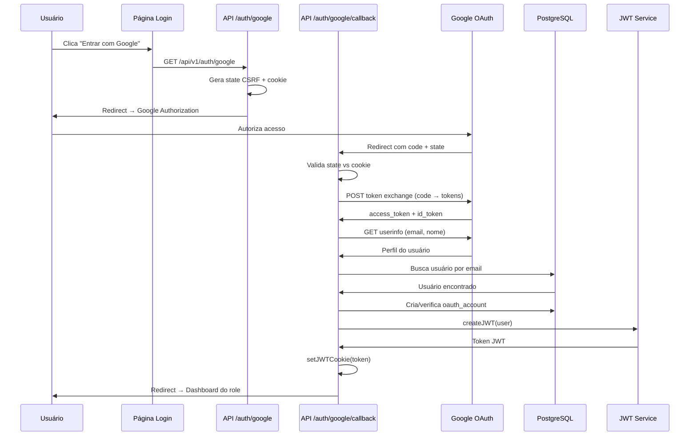
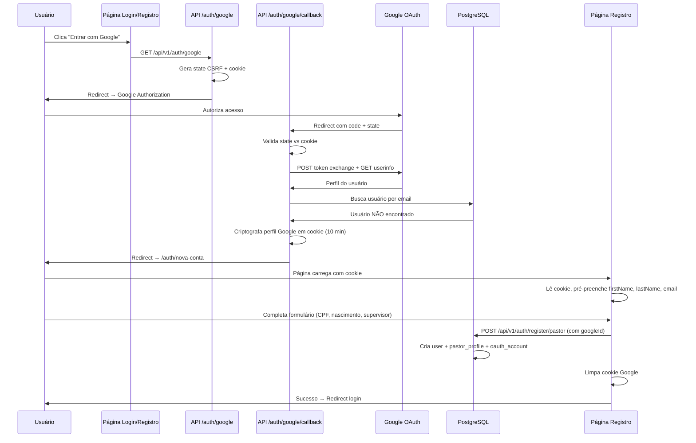

# Design: Login com Google OAuth 2.0

## Visão Geral

Este design descreve a implementação do login com Google OAuth 2.0 no Vinha Admin Center, integrando-se ao sistema JWT existente. O fluxo segue o padrão Authorization Code do OAuth 2.0.

Existem dois caminhos distintos após o callback do Google:

1. **Usuário existente**: login direto com emissão de JWT e redirecionamento ao dashboard
2. **Novo usuário**: redirecionamento para `/auth/nova-conta` com dados do Google em cookie criptografado para pré-preenchimento do formulário de registro

Não serão utilizadas bibliotecas de autenticação externas (NextAuth, Lucia, etc.). A implementação usa diretamente as APIs REST do Google OAuth 2.0.

## Arquitetura

### Fluxo para Usuário Existente



### Fluxo para Novo Usuário



## Componentes e Interfaces

### 1. Rota de Início do Fluxo OAuth (`/api/v1/auth/google/route.ts`)

Endpoint GET que inicia o fluxo OAuth:

```typescript
// GET /api/v1/auth/google
// Responsabilidades:
// - Gerar state CSRF (32 bytes, crypto.randomBytes)
// - Armazenar state em cookie httpOnly (max-age: 10 min)
// - Construir URL de autorização Google com parâmetros:
//   - client_id, redirect_uri, response_type=code
//   - scope: openid email profile
//   - state, prompt=select_account
// - Redirecionar o usuário para o Google

interface GoogleAuthConfig {
  clientId: string
  clientSecret: string
  redirectUri: string // Construído dinamicamente via NEXT_PUBLIC_APP_URL
}
```

### 2. Rota de Callback OAuth (`/api/v1/auth/google/callback/route.ts`)

Endpoint GET que processa o retorno do Google:

```typescript
// GET /api/v1/auth/google/callback?code=...&state=...
// Responsabilidades:
// - Validar state contra cookie
// - Trocar code por tokens via POST https://oauth2.googleapis.com/token
// - Obter perfil via GET https://www.googleapis.com/oauth2/v2/userinfo
// - Validar email_verified === true
// - Buscar usuário por email no banco
//   → Se existe: vincular/verificar oauth_account, emitir JWT, redirect dashboard
//   → Se NÃO existe: criptografar perfil em cookie, redirect /auth/nova-conta

interface GoogleTokenResponse {
  access_token: string
  id_token: string
  token_type: string
  expires_in: number
}

interface GoogleUserInfo {
  id: string // Google Account ID
  email: string
  verified_email: boolean
  name: string
  given_name: string
  family_name: string
  picture: string
}

interface GoogleProfileCookieData {
  googleId: string
  email: string
  firstName: string
  lastName: string
}
```

### 3. Módulo de Configuração Google OAuth (`/lib/google-oauth.ts`)

Utilitário centralizado para operações OAuth:

```typescript
// Funções exportadas:
function getGoogleAuthUrl(state: string): string
// Constrói a URL de autorização com todos os parâmetros

function exchangeCodeForTokens(code: string): Promise<GoogleTokenResponse>
// Troca o authorization code por tokens via POST

function getGoogleUserInfo(accessToken: string): Promise<GoogleUserInfo>
// Obtém o perfil do usuário via API do Google

function getGoogleOAuthConfig(): GoogleAuthConfig
// Retorna configuração validada (client_id, secret, redirect_uri)

function isGoogleOAuthEnabled(): boolean
// Verifica se as credenciais estão configuradas

function encryptGoogleProfile(data: GoogleProfileCookieData): string
// Criptografa dados do perfil para armazenar em cookie (AES-256-GCM com chave derivada de GOOGLE_CLIENT_SECRET)

function decryptGoogleProfile(encrypted: string): GoogleProfileCookieData | null
// Descriptografa dados do perfil do cookie, retorna null se inválido/expirado
```

### 4. Serviço de Vinculação de Contas (`/lib/oauth-account-service.ts`)

Lógica de negócio para vincular contas existentes e decidir fluxo:

```typescript
interface OAuthLoginResult {
  type: 'login' | 'register'
  user?: { id: string; email: string; role: UserRole }
  googleProfile?: GoogleProfileCookieData
}

function handleGoogleCallback(googleUser: GoogleUserInfo): Promise<OAuthLoginResult>
// Lógica:
// 1. Buscar oauth_account por provider='google' + providerAccountId
// 2. Se encontrou → buscar user → retornar { type: 'login', user }
// 3. Se não encontrou → buscar user por email
//    a. Se user existe sem oauth → criar oauth_account → retornar { type: 'login', user }
//    b. Se user existe com oauth diferente → erro (email já vinculado)
//    c. Se user NÃO existe → retornar { type: 'register', googleProfile }

function linkGoogleAccountToUser(userId: string, googleData: GoogleProfileCookieData): Promise<void>
// Cria registro na oauth_accounts vinculando o Google ID ao usuário recém-registrado
// Chamado pela API de registro quando googleId está presente no body
```

### 5. Componente do Botão Google (`/components/ui/GoogleLoginButton.tsx`)

```typescript
interface GoogleLoginButtonProps {
  disabled?: boolean
  variant?: 'login' | 'register' // Controla texto exibido
}

// Comportamento:
// - variant='login': texto "Entrar com Google"
// - variant='register': texto "Preencher com Google"
// - Ao clicar, redireciona para /api/v1/auth/google
// - Exibe spinner durante redirecionamento
// - Aceita prop disabled para quando credenciais não estão configuradas
```

### 6. Atualização da Página de Registro (`/auth/nova-conta/page.tsx`)

```typescript
// Mudanças necessárias:
// - Criar API route GET /api/v1/auth/google/profile para ler e retornar dados do cookie criptografado
// - No carregamento da página, chamar essa API para obter dados do Google (se existirem)
// - Se dados presentes: pré-preencher firstName, lastName, email no PastorForm
// - Exibir badge "Dados do Google" nos campos pré-preenchidos
// - Adicionar GoogleLoginButton com variant='register' acima do formulário
// - Campos pré-preenchidos permanecem editáveis
// - Armazenar googleId em state para enviar junto com o registro
```

### 7. Atualização das APIs de Registro

```typescript
// POST /api/v1/auth/register/pastor
// Mudanças:
// - Aceitar campo opcional `googleId` no body do request
// - Se googleId presente: após criar user + pastor_profile, chamar linkGoogleAccountToUser
// - Limpar Cookie_Google_Profile no header Set-Cookie da resposta

// POST /api/v1/auth/register/church
// Mudanças:
// - Aceitar campo opcional `googleId` no body do request
// - Se googleId presente: após criar user, chamar linkGoogleAccountToUser
// - Limpar Cookie_Google_Profile no header Set-Cookie da resposta
```

## Modelo de Dados

### Nova Tabela: `oauth_accounts`

```typescript
export const oauthAccounts = pgTable(
  'oauth_accounts',
  {
    id: uuid('id')
      .primaryKey()
      .default(sql`gen_random_uuid()`),
    userId: uuid('user_id')
      .references(() => users.id, { onDelete: 'cascade' })
      .notNull(),
    provider: varchar('provider', { length: 50 }).notNull(), // 'google'
    providerAccountId: varchar('provider_account_id', { length: 255 }).notNull(),
    providerEmail: varchar('provider_email', { length: 255 }),
    createdAt: timestamp('created_at').defaultNow().notNull(),
    updatedAt: timestamp('updated_at').defaultNow(),
  },
  (table) => ({
    uniqueProviderAccount: unique().on(table.provider, table.providerAccountId),
    uniqueProviderUser: unique().on(table.provider, table.userId),
  }),
)
```

### Alteração na Tabela `users`

O campo `password` precisa se tornar nullable para suportar usuários que se registram via Google (sem senha definida inicialmente):

```sql
ALTER TABLE users ALTER COLUMN password DROP NOT NULL;
```

No schema Drizzle:

```typescript
password: text('password'),  // Remover .notNull()
```

### Relações

```typescript
export const oauthAccountsRelations = relations(oauthAccounts, ({ one }) => ({
  user: one(users, { fields: [oauthAccounts.userId], references: [users.id] }),
}))

// Adicionar à usersRelations existente:
oauthAccounts: many(oauthAccounts),
```

### Variáveis de Ambiente (adições ao env.ts)

```typescript
// Adicionar ao envSchema:
GOOGLE_CLIENT_ID: z.string().min(1, 'GOOGLE_CLIENT_ID é obrigatória').optional(),
GOOGLE_CLIENT_SECRET: z.string().min(1, 'GOOGLE_CLIENT_SECRET é obrigatória').optional(),
```

As variáveis são opcionais no schema para que o sistema funcione sem Google OAuth configurado, mas o botão será desabilitado na UI quando ausentes.

## Propriedades de Corretude

_Uma propriedade é uma característica ou comportamento que deve ser verdadeiro em todas as execuções válidas de um sistema — essencialmente, uma declaração formal sobre o que o sistema deve fazer. Propriedades servem como ponte entre especificações legíveis por humanos e garantias de corretude verificáveis por máquina._

As propriedades abaixo foram derivadas dos critérios de aceitação do documento de requisitos, após análise de testabilidade e eliminação de redundâncias.

### Property 1: URL de autorização contém todos os parâmetros obrigatórios

_Para qualquer_ state CSRF gerado e qualquer configuração OAuth válida (clientId, redirectUri), a URL de autorização produzida por `getGoogleAuthUrl(state)` deve conter: o `client_id` correto, o `redirect_uri` correto, `response_type=code`, os escopos `openid email profile`, o `state` fornecido e `prompt=select_account`.

**Validates: Requirements 1.1, 7.4, 8.2**

### Property 2: Validação de state CSRF é estrita

_Para quaisquer_ dois strings `stateGerado` e `stateRecebido`, a validação de state deve aceitar se e somente se `stateGerado === stateRecebido`. Strings diferentes devem sempre ser rejeitadas.

**Validates: Requirements 1.2, 1.3**

### Property 3: Login Google para usuário existente preserva vinculação

_Para qualquer_ usuário existente no banco de dados e qualquer perfil Google cujo email corresponda ao email do usuário, `handleGoogleCallback` deve retornar `type='login'` com o mesmo userId do usuário existente e garantir que existe um registro em `oauth_accounts` vinculando o provider `google` com o `providerAccountId` do perfil Google ao userId.

**Validates: Requirements 2.1, 2.2**

### Property 4: Novo usuário retorna redirecionamento para registro

_Para qualquer_ perfil Google válido (email verificado) cujo email não exista no banco de dados, `handleGoogleCallback` deve retornar `type='register'` com `googleProfile` contendo o googleId, email, firstName e lastName extraídos do perfil Google.

**Validates: Requirements 3.1**

### Property 5: Criptografia do perfil Google é round-trip

_Para qualquer_ objeto `GoogleProfileCookieData` válido (googleId, email, firstName, lastName não-vazios), `decryptGoogleProfile(encryptGoogleProfile(data))` deve produzir um objeto equivalente ao original.

**Validates: Requirements 3.2, 7.5**

### Property 6: Registro com Google cria vinculação oauth_account

_Para qualquer_ dados de registro válidos (pastor ou igreja) que incluam um `googleId`, após a criação bem-sucedida do usuário, deve existir um registro na `oauth_accounts` com `provider='google'`, `providerAccountId` igual ao `googleId` fornecido, e `userId` igual ao ID do usuário recém-criado.

**Validates: Requirements 3.3**

### Property 7: JWT emitido após login Google contém dados corretos (round-trip)

_Para qualquer_ usuário retornado por `handleGoogleCallback` com `type='login'`, o JWT criado por `createJWT` e subsequentemente decodificado por `verifyJWT` deve conter `userId`, `email` e `role` idênticos aos do usuário original.

**Validates: Requirements 5.1**

### Property 8: Mapeamento role para path de redirecionamento é completo

_Para qualquer_ role válido do sistema (`admin`, `manager`, `supervisor`, `pastor`, `church_account`), a função de mapeamento role→path deve retornar um path não-vazio que corresponde ao dashboard correto do role.

**Validates: Requirements 5.3**

### Property 9: Mapeamento de código de erro para mensagem é completo

_Para qualquer_ código de erro OAuth definido no sistema, a função de mapeamento deve retornar uma mensagem de erro não-vazia em português.

**Validates: Requirements 6.4**

## Tratamento de Erros

### Erros do Fluxo OAuth

| Cenário                           | Ação                              | Redirecionamento                              |
| --------------------------------- | --------------------------------- | --------------------------------------------- |
| State CSRF inválido               | Log de warning + mensagem de erro | `/auth/login?error=invalid_state`             |
| Troca de código falhou            | Log de error com detalhes         | `/auth/login?error=token_exchange_failed`     |
| Email não verificado              | Log de warning                    | `/auth/login?error=email_not_verified`        |
| Email vinculado a outro Google ID | Log de warning                    | `/auth/login?error=account_conflict`          |
| Erro interno (DB, rede)           | Log de error com stack            | `/auth/login?error=internal_error`            |
| Rate limit excedido               | Resposta 429                      | `/auth/login?error=rate_limited`              |
| Cookie Google Profile expirado    | Nenhum (formulário manual)        | N/A (página de registro funciona normalmente) |

### Códigos de Erro e Mensagens

```typescript
const OAUTH_ERROR_MESSAGES: Record<string, string> = {
  invalid_state: 'A sessão de autenticação expirou. Tente novamente.',
  token_exchange_failed: 'Não foi possível autenticar com o Google. Tente novamente.',
  email_not_verified:
    'O email da conta Google não está verificado. Verifique seu email no Google e tente novamente.',
  account_conflict: 'Este email já está vinculado a outra conta Google.',
  internal_error: 'Ocorreu um erro interno. Tente novamente mais tarde.',
  rate_limited: 'Muitas tentativas. Aguarde alguns minutos e tente novamente.',
}
```

### Princípios de Tratamento

- Mensagens de erro para o usuário são sempre genéricas e em pt-BR
- Detalhes técnicos são registrados apenas no log do servidor
- Erros de validação (state, email_verified) retornam mensagens específicas mas não técnicas
- Erros de infraestrutura (DB, rede) retornam mensagem genérica
- Cookie expirado não é tratado como erro — o formulário simplesmente funciona sem pré-preenchimento

## Estratégia de Testes

### Testes Unitários

Focados em exemplos específicos e edge cases:

- Geração de URL com configuração válida (exemplo concreto)
- Callback com state inválido retorna erro
- Callback com email não verificado retorna erro
- Conflito de Google ID com conta existente retorna erro
- Variáveis de ambiente ausentes desabilita feature
- Cascade delete remove oauth_accounts
- Cookie Google Profile expirado resulta em formulário manual
- Registro com googleId cria oauth_account junto com o usuário
- Registro sem googleId funciona normalmente (sem oauth_account)

### Testes de Propriedade (Property-Based Testing)

Biblioteca recomendada: **fast-check** (TypeScript)

Configuração: mínimo 100 iterações por propriedade.

Cada propriedade do design deve ser implementada como um teste separado:

- **Feature: google-login, Property 1: URL de autorização contém todos os parâmetros obrigatórios**
- **Feature: google-login, Property 2: Validação de state CSRF é estrita**
- **Feature: google-login, Property 3: Login Google para usuário existente preserva vinculação**
- **Feature: google-login, Property 4: Novo usuário retorna redirecionamento para registro**
- **Feature: google-login, Property 5: Criptografia do perfil Google é round-trip**
- **Feature: google-login, Property 6: Registro com Google cria vinculação oauth_account**
- **Feature: google-login, Property 7: JWT emitido após login Google contém dados corretos (round-trip)**
- **Feature: google-login, Property 8: Mapeamento role para path de redirecionamento é completo**
- **Feature: google-login, Property 9: Mapeamento de código de erro para mensagem é completo**

As Properties 3, 4 e 6 requerem mocking do banco de dados para isolar a lógica de negócio.

### Abordagem Complementar

- Testes unitários cobrem exemplos concretos e edge cases (state inválido, email não verificado, conflito de conta, cookie expirado)
- Testes de propriedade cobrem invariantes universais (URL sempre válida, state sempre validado corretamente, round-trip de criptografia e JWT, mapeamentos completos)
- Juntos, garantem cobertura abrangente do fluxo OAuth com os dois caminhos (login e registro)
