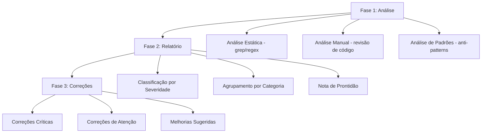

# Design — Auditoria de Produção

## Visão Geral

Este design descreve a abordagem para realizar uma auditoria completa do sistema Vinha Admin Center, um sistema Next.js 15 em produção. A auditoria será executada como uma série de análises estáticas e manuais do código-fonte, cobrindo 4 categorias: bugs/erros, segurança, custos e resiliência. O resultado será um relatório estruturado com classificação de severidade e sugestões de correção, seguido de tasks para corrigir os problemas mais críticos encontrados.

A auditoria é fundamentalmente um processo de análise de código — não envolve criação de novas funcionalidades, mas sim a inspeção sistemática do código existente e a aplicação de correções pontuais.

## Arquitetura

A auditoria segue uma abordagem em 3 fases:



### Escopo de Arquivos

O projeto possui a seguinte estrutura relevante para auditoria:

- `src/app/api/` — ~50+ rotas API (v1 + auth + cron + webhooks)
- `src/lib/` — ~30+ módulos utilitários e integrações
- `src/middleware.ts` — Middleware global
- `src/workers/` — Workers de background (BullMQ)
- `src/actions/` — Server actions
- `src/hooks/` — Custom hooks React
- `src/components/` — Componentes React

### Integrações Externas Críticas

| Serviço       | Módulo                                         | Risco                                      |
| ------------- | ---------------------------------------------- | ------------------------------------------ |
| Cielo API     | `src/lib/cielo.ts`                             | Cobranças duplicadas, sem timeout em fetch |
| AWS S3        | `src/lib/s3-client.ts`                         | Uploads sem validação, custos              |
| AWS SES       | `src/lib/email.ts`, `src/lib/notifications.ts` | Spam, bounces                              |
| Evolution API | `src/lib/notifications.ts`                     | Conexão volátil, sem timeout               |
| Redis/BullMQ  | `src/lib/redis.ts`, `src/lib/queues.ts`        | SPOF, sem fallback                         |
| PostgreSQL    | `src/db/drizzle.ts`                            | Queries sem limit, N+1                     |

## Componentes e Interfaces

### Componente 1: Analisador de Bugs

Responsável por detectar padrões de código problemáticos via análise estática (grep/regex) e revisão manual.

**Padrões a detectar:**

- `catch\s*\{\s*\}` ou `catch\s*\(\w+\)\s*\{\s*\}` — catch blocks vazios
- `: any` ou `as any` — uso de tipo any
- `fetch(` sem `signal:` — fetch sem timeout/abort
- `AbortSignal.timeout` — incompatível com Edge Runtime
- `console.log(` — debug statements em produção

### Componente 2: Analisador de Segurança

Responsável por detectar vulnerabilidades de segurança.

**Padrões a detectar:**

- Rotas API em `src/app/api/` sem `validateRequest()` ou `validateJWTRequest()`
- Rotas API sem validação Zod (`z.object`, `z.string`, `.parse(`, `.safeParse(`)
- Endpoints sem `rateLimit(`
- `process.env.` usado diretamente sem validação (fora de `env.ts`)
- Secrets hardcoded (strings que parecem tokens/chaves)
- Headers de segurança ausentes no middleware

### Componente 3: Analisador de Custos

Responsável por detectar padrões que podem gerar custos excessivos.

**Padrões a detectar:**

- `db.select()` sem `.limit(` — queries sem limite
- Loops com `await` dentro (`for...of` + `await fetch/db`) — N+1
- `createPixPayment`/`createCreditCardPayment` sem `checkDuplicatePayment` — idempotência
- Uploads sem `validateUpload` — arquivos grandes no S3

### Componente 4: Analisador de Resiliência

Responsável por detectar pontos de falha do sistema.

**Padrões a detectar:**

- `fetch(` sem `AbortController` ou timeout — operações sem timeout
- Operações multi-step sem `db.transaction(` — falta de atomicidade
- Dependências de Redis sem fallback (`if (!redis)` ausente)
- Event listeners sem cleanup em hooks React

### Componente 5: Gerador de Relatório

Responsável por consolidar todos os achados em um relatório estruturado.

**Interface do relatório:**

```typescript
interface AuditFinding {
  severity: '🔴 CRÍTICO' | '🟡 ATENÇÃO' | '🟢 SUGESTÃO'
  category: 'Bugs' | 'Segurança' | 'Custos' | 'Resiliência'
  file: string
  line: number
  description: string
  impact: string
  suggestion: string
}

interface AuditReport {
  findings: AuditFinding[]
  score: number // 0-10
  topActions: string[] // 5 ações mais urgentes
  summary: {
    critical: number
    warning: number
    suggestion: number
  }
}
```

## Modelos de Dados

### Estrutura do Relatório de Auditoria

O relatório será gerado como um arquivo Markdown (`AUDIT_REPORT.md`) na raiz do projeto com a seguinte estrutura:

```markdown
# Relatório de Auditoria — Vinha Admin Center

## Data: [data]

## Nota de Prontidão: X/10

## Resumo Executivo

- 🔴 Críticos: N
- 🟡 Atenção: N
- 🟢 Sugestões: N

## 1. Bugs e Erros

| #   | Severidade | Arquivo | Linha | Descrição | Impacto | Correção |
| --- | ---------- | ------- | ----- | --------- | ------- | -------- |

## 2. Segurança

[mesma tabela]

## 3. Custos

[mesma tabela]

## 4. Resiliência

[mesma tabela]

## Top 5 Ações Urgentes

1. ...
```

### Categorias de Severidade

| Severidade  | Critério                                                                               |
| ----------- | -------------------------------------------------------------------------------------- |
| 🔴 CRÍTICO  | Pode causar perda de dados, falha de segurança, cobrança duplicada ou crash do sistema |
| 🟡 ATENÇÃO  | Pode causar degradação de performance, comportamento inesperado ou custos elevados     |
| 🟢 SUGESTÃO | Melhoria de qualidade de código, manutenibilidade ou boas práticas                     |

### Padrões de Correção

Para cada tipo de problema, existe um padrão de correção definido:

**Catch vazio → Logging com contexto:**

```typescript
// Antes
try {
  await op()
} catch {}

// Depois
try {
  await op()
} catch (error) {
  console.error('[CONTEXTO] Erro ao executar operação:', error)
}
```

**Rota sem auth → Adicionar validateRequest:**

```typescript
// Adicionar no início da rota
const { user } = await validateRequest()
if (!user) {
  return NextResponse.json({ error: 'Não autorizado' }, { status: 401 })
}
```

**Query sem limit → Adicionar paginação:**

```typescript
// Antes
const results = await db.select().from(table).where(...)

// Depois
const results = await db.select().from(table).where(...).limit(100)
```

**Fetch sem timeout → AbortController:**

```typescript
// Antes
const response = await fetch(url)

// Depois
const controller = new AbortController()
const timeoutId = setTimeout(() => controller.abort(), 10000)
try {
  const response = await fetch(url, { signal: controller.signal })
  clearTimeout(timeoutId)
} catch (error) {
  clearTimeout(timeoutId)
  throw error
}
```

## Propriedades de Corretude

_Uma propriedade é uma característica ou comportamento que deve ser verdadeiro em todas as execuções válidas de um sistema — essencialmente, uma declaração formal sobre o que o sistema deve fazer. Propriedades servem como ponte entre especificações legíveis por humanos e garantias de corretude verificáveis por máquina._

As propriedades abaixo definem regras que devem valer para todo o código-fonte do projeto. Elas são verificáveis por análise estática (grep/regex + scripts) e servem como critérios de aprovação da auditoria.

### Propriedade 1: Rotas protegidas devem ter autenticação JWT

_Para toda_ rota API em `src/app/api/` que não seja explicitamente pública (health, auth/login, auth/register, cep, webhooks, maintenance-check, company/public), o arquivo `route.ts` deve conter uma chamada a `validateRequest()` ou `validateJWTRequest()`.

**Valida: Requisitos 2.1**

### Propriedade 2: Rotas com entrada de dados devem ter validação Zod

_Para toda_ rota API que implementa POST, PUT ou PATCH, o arquivo `route.ts` deve conter uso de Zod (importação de `z` de `zod`, ou uso de `.parse(`, `.safeParse(`).

**Valida: Requisitos 2.3**

### Propriedade 3: Endpoints públicos devem ter rate limiting

_Para toda_ rota API pública (auth/login, auth/register, forgot-password, reset-password, webhooks), o arquivo `route.ts` deve conter uma chamada a `rateLimit(`.

**Valida: Requisitos 2.4**

### Propriedade 4: Uso de process.env deve ser validado

_Para todo_ uso de `process.env.` em arquivos fora de `src/lib/env.ts`, deve haver validação (verificação de existência ou uso do objeto `env` importado de `@/lib/env`).

**Valida: Requisitos 2.7**

### Propriedade 5: Queries SELECT devem ter limite

_Para toda_ chamada `db.select()` no código-fonte, deve haver `.limit(` na mesma cadeia de chamadas, exceto quando a query filtra por ID único (`.where(eq(...id...))` retornando registro único com destructuring).

**Valida: Requisitos 3.1**

### Propriedade 6: Chamadas fetch devem ter timeout

_Para toda_ chamada `fetch(` no código-fonte (excluindo node_modules), deve haver um `AbortController` ou `signal:` configurado no mesmo escopo.

**Valida: Requisitos 4.1**

### Propriedade 7: Ausência de AbortSignal.timeout()

_Para todo_ arquivo TypeScript no projeto, não deve existir uso de `AbortSignal.timeout(` pois é incompatível com Edge Runtime.

**Valida: Requisitos 4.2**

### Propriedade 8: Uso de Redis deve ter fallback

_Para todo_ uso de `redis` (importado de `@/lib/redis`) no código-fonte, deve haver verificação `if (!redis)` ou tratamento de falha antes de operações Redis.

**Valida: Requisitos 4.4**

### Propriedade 9: Catch blocks não devem ser vazios

_Para todo_ bloco `catch` no código-fonte TypeScript, o corpo do catch deve conter pelo menos uma instrução (logging, throw, return, ou atribuição).

**Valida: Requisitos 1.1**

## Tratamento de Erros

### Erros durante a Auditoria

- Se um arquivo não puder ser lido, registrar no relatório como "arquivo inacessível" e continuar
- Se um padrão regex falhar, registrar e usar análise manual como fallback
- Se o TypeScript compiler falhar, registrar o erro e continuar com análise de padrões

### Erros durante as Correções

- Cada correção deve ser atômica — se falhar, reverter ao estado anterior
- Correções devem ser validadas com `getDiagnostics` após aplicação
- Correções não devem introduzir novos erros de compilação

### Classificação de Erros Encontrados

| Tipo de Erro           | Severidade Padrão | Ação                           |
| ---------------------- | ----------------- | ------------------------------ |
| Catch vazio            | 🟡 ATENÇÃO        | Adicionar logging              |
| Rota sem auth          | 🔴 CRÍTICO        | Adicionar validateRequest      |
| Rota sem Zod           | 🟡 ATENÇÃO        | Adicionar schema Zod           |
| Query sem limit        | 🟡 ATENÇÃO        | Adicionar .limit()             |
| Fetch sem timeout      | 🟡 ATENÇÃO        | Adicionar AbortController      |
| AbortSignal.timeout    | 🔴 CRÍTICO        | Substituir por AbortController |
| Secret hardcoded       | 🔴 CRÍTICO        | Mover para env var             |
| Tipo any               | 🟡 ATENÇÃO        | Definir tipo explícito         |
| Dados sensíveis em log | 🔴 CRÍTICO        | Usar safeLog/safeError         |

## Estratégia de Testes

### Testes Unitários

- Verificar que cada padrão regex detecta corretamente os problemas esperados
- Verificar que o relatório é gerado com a estrutura correta
- Verificar que as correções não quebram a compilação TypeScript

### Testes Baseados em Propriedades

Biblioteca: `fast-check` (já instalada no projeto)

Cada propriedade de corretude será implementada como um teste baseado em propriedades que verifica o código-fonte do projeto:

- Mínimo de 100 iterações por teste de propriedade
- Cada teste deve referenciar a propriedade do design
- Formato de tag: **Feature: production-audit, Property N: [título]**

Na prática, como a auditoria é uma análise estática de código existente (não geração de dados aleatórios), os testes de propriedade serão implementados como verificações exaustivas sobre o conjunto de arquivos do projeto — iterando sobre todos os arquivos relevantes e verificando que cada propriedade é satisfeita.

### Abordagem Dual

- **Testes unitários**: Verificar exemplos específicos de problemas conhecidos e edge cases
- **Testes de propriedade**: Verificar que as regras valem para TODOS os arquivos do projeto (cobertura exaustiva)
