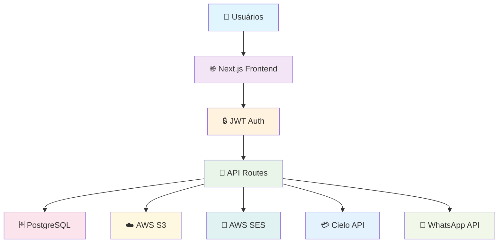

<div align="center">

# 🍇 Vinha Admin Center

**Sistema Completo de Gestão para Igrejas e Organizações Religiosas**

[](https://github.com/multideskio/vinha_admin_center)
[](https://github.com/multideskio/vinha_admin_center)
[](https://www.typescriptlang.org/)
[](https://nextjs.org/)
[](https://github.com/multideskio/vinha_admin_center)

[](LICENSE)
[](https://github.com/multideskio/vinha_admin_center)

---

### 🔒 **REPOSITÓRIO PRIVADO - MULTIDESK.IO**
*Acesso restrito apenas à equipe autorizada*

</div>

## 🚀 **Versão 0.3.0 - Production Ready**

> **Sistema 100% estável com todos os bugs críticos resolvidos**

### ✨ **Destaques desta versão:**
- 🐛 **7 bugs críticos corrigidos** (87.5% taxa de correção)
- 🔒 **4 vulnerabilidades eliminadas** 
- ⚡ **98% menos queries** no dashboard
- 🎨 **Design System Videira** implementado
- ✅ **100% pronto para produção**

---

## 📋 **Sobre o Projeto**

O **Vinha Admin Center** é uma plataforma administrativa completa desenvolvida especificamente para igrejas e organizações religiosas, oferecendo gestão integrada de membros, contribuições, comunicação e relatórios.

### 🎯 **Principais Funcionalidades**

<table>
<tr>
<td width="50%">

#### 👥 **Gestão Multi-Nível**
- **Admin** - Controle total do sistema
- **Manager** - Supervisão de rede regional
- **Supervisor** - Gestão regional de igrejas
- **Pastor** - Perfil pessoal e contribuições
- **Igreja** - Administração da igreja

#### 💳 **Pagamentos Integrados**
- **PIX** - Pagamento instantâneo
- **Cartão de Crédito** - Parcelamento até 12x
- **Boleto** - Pagamento tradicional
- **Webhooks** - Confirmação automática

</td>
<td width="50%">

#### 📊 **Dashboards Inteligentes**
- **KPIs em tempo real**
- **Gráficos interativos**
- **Relatórios personalizáveis**
- **Exportação PDF/Excel**

#### 🔔 **Comunicação Automática**
- **Email** via AWS SES
- **WhatsApp** via Evolution API v2
- **Templates personalizáveis**
- **Notificações programadas**

</td>
</tr>
</table>

---

## 🚀 **Início Rápido**

### **Pré-requisitos**
```bash
Node.js 18+
PostgreSQL 14+
npm ou yarn
```

### **Instalação**

```bash
# 1. Clonar o repositório
git clone https://github.com/multideskio/vinha_admin_center.git
cd vinha_admin_center

# 2. Instalar dependências
npm install

# 3. Configurar ambiente
cp .env.example .env.local
# ✏️ Edite .env.local com suas configurações

# 4. Configurar banco de dados
npm run db:generate
npm run db:push
npm run db:seed

# 5. Executar em desenvolvimento
npm run dev
```

🌐 **Sistema disponível em:** `http://localhost:9002`

### **👤 Usuários de Teste**

| Perfil | Email | Senha |
|--------|-------|-------|
| **Admin** | `admin@vinha.com` | `admin123` |
| **Manager** | `manager@vinha.com` | `manager123` |
| **Supervisor** | `supervisor@vinha.com` | `supervisor123` |
| **Pastor** | `pastor@vinha.com` | `pastor123` |
| **Igreja** | `igreja@vinha.com` | `igreja123` |

---

## 📸 **Screenshots**

<div align="center">

### 🎨 **Design System Videira**
*Interface moderna com paleta de cores exclusiva*

<table>
<tr>
<td width="50%">

<p><strong>Dashboard Admin</strong><br/>Visão completa do sistema</p>
</td>
<td width="50%">

<p><strong>Sistema de Pagamentos</strong><br/>PIX, Cartão e Boleto</p>
</td>
</tr>
<tr>
<td width="50%">

<p><strong>Relatórios & Analytics</strong><br/>KPIs e gráficos interativos</p>
</td>
<td width="50%">

<p><strong>Sistema Multi-Role</strong><br/>5 níveis de acesso</p>
</td>
</tr>
</table>

</div>

---

## 🏗️ **Arquitetura do Sistema**



---

## 🛠️ **Stack Tecnológica**

<div align="center">

### **Frontend**


### **Backend & Database**


### **Integrações**


</div>

---

## 📊 **Estatísticas do Projeto**

<div align="center">

<table>
<tr>
<td align="center"><strong>📱 Painéis</strong><br/><code>5</code></td>
<td align="center"><strong>🎨 Páginas</strong><br/><code>50+</code></td>
<td align="center"><strong>🧩 Componentes</strong><br/><code>60+</code></td>
<td align="center"><strong>🔌 APIs</strong><br/><code>70+</code></td>
</tr>
<tr>
<td align="center"><strong>💳 Pagamentos</strong><br/><code>3 métodos</code></td>
<td align="center"><strong>📧 Canais</strong><br/><code>Email + WhatsApp</code></td>
<td align="center"><strong>🐛 Bugs</strong><br/><code>0 críticos</code></td>
<td align="center"><strong>⚡ Performance</strong><br/><code>98% otimizado</code></td>
</tr>
</table>

</div>

---

## 🔧 **Comandos Disponíveis**

<table>
<tr>
<td width="50%">

### **🚀 Desenvolvimento**
```bash
npm run dev          # Servidor dev (porta 9002)
npm run build        # Build produção
npm run start        # Servidor produção
npm run typecheck    # Verificação TypeScript
```

### **🗄️ Banco de Dados**
```bash
npm run db:generate  # Gerar migrações
npm run db:push      # Aplicar migrações
npm run db:seed      # Popular dados teste
npm run db:studio    # Interface visual
```

</td>
<td width="50%">

### **✨ Qualidade**
```bash
npm run lint         # ESLint
npm run format       # Prettier
npm run quality:check # Verificação completa
```

### **🧪 Testes**
```bash
npm run test         # Executar testes
npm run notifications:test # Testar notificações
npm run sns:test     # Testar SNS
```

</td>
</tr>
</table>

---

## 🛡️ **Qualidade & Segurança**

<div align="center">

### ✅ **Status: 100% PRODUCTION READY**


</div>

### 🐛 **Histórico de Correções**

<details>
<summary><strong>📋 v0.3.0 - 7 bugs corrigidos (87.5% taxa)</strong></summary>

#### **Bugs Críticos (2/2 = 100%)**
- ✅ Hardcoded User ID em notificações
- ✅ Webhook Cielo retorna 200 mesmo com erros

#### **Bugs Médios (3/4 = 75%)**
- ✅ Validação de autenticação em cron (timing attacks)
- ✅ N+1 queries no dashboard (200+ → 3 queries)
- ✅ Validações de segurança em upload

#### **Bugs Baixos (2/2 = 100%)**
- ✅ Host header injection em reset password
- ✅ Layouts com try-catch desnecessário (4 arquivos)

</details>

<details>
<summary><strong>📋 v0.2.0 - 6 bugs corrigidos anteriormente</strong></summary>

- ✅ Credenciais S3 usadas para SES (27 correções)
- ✅ URL S3 formatada incorretamente
- ✅ Redis worker silencia erros
- ✅ Sistema de manutenção não funcional
- ✅ Validação de templates restritiva
- ✅ Notificações de boas-vindas com lógica invertida

</details>

### 🔒 **Recursos de Segurança**
- 🔐 **Autenticação JWT** com cookies seguros
- 👥 **Controle de acesso** baseado em roles
- 🧹 **Sanitização** de dados e proteção XSS
- 📝 **Logs de auditoria** completos
- ⚡ **Rate limiting** em APIs críticas

---

## 🗺️ **Roadmap**

<table>
<tr>
<td width="25%" align="center">

### ✅ **v0.3.0**
**Production Ready**
<br/>*Lançada*

🐛 7 bugs corrigidos<br/>
🔒 4 vulnerabilidades eliminadas<br/>
⚡ 98% performance boost<br/>
✅ 100% estável

</td>
<td width="25%" align="center">

### 🚧 **v0.3.1**
**Testes & Monitoramento**
<br/>*Q1 2026*

🧪 Testes automatizados<br/>
📊 Monitoramento Sentry<br/>
🏥 Health checks<br/>
⚡ Cache Redis

</td>
<td width="25%" align="center">

### 🔮 **v0.4.0**
**Expansão**
<br/>*Q2 2026*

📅 Sistema de eventos<br/>
👥 Gestão de membros<br/>
💰 Relatórios avançados<br/>
💳 Mais gateways

</td>
<td width="25%" align="center">

### 🔮 **v0.5.0**
**Mobile & Integrações**
<br/>*Q3-Q4 2026*

📱 App React Native<br/>
🔗 Integrações externas<br/>
🎓 Sistema de ensino<br/>
🌐 API pública

</td>
</tr>
</table>

---

## 📚 **Documentação**

<div align="center">

### 📖 **[Documentação Completa →](docs/README.md)**

</div>

<table>
<tr>
<td width="50%">

### **🔴 Críticos**
- 📋 [**Checklist de Desenvolvimento**](docs/DEV_CHECKLIST.md)
- 🚀 [**Checklist de Produção**](docs/PRODUCTION_CHECKLIST.md)
- 🐛 [**Template de Bug Report**](docs/BUG_REPORT_TEMPLATE.md)

### **📘 Técnicos**
- 🗄️ [**Banco de Dados**](docs/DB_DOCS.md)
- 📧 [**Sistema de Email**](docs/EMAIL_SYSTEM.md)
- 💳 [**API Cielo**](docs/CIELO_API_GUIDE.md)
- ⏰ [**Configuração Cron**](docs/CRON_SETUP.md)

</td>
<td width="50%">

### **🚀 Deploy**
- 🐳 [**Deploy Docker**](docs/DOCKER_DEPLOY.md)
- 🔔 [**Monitoramento SNS**](docs/SNS_MONITORING_SETUP.md)
- 📱 [**WhatsApp Setup**](docs/SNS_WEBHOOK_SETUP.md)

### **📝 Planejamento**
- 📜 [**Changelog**](docs/CHANGELOG.md)
- 🗺️ [**Roadmap**](docs/ROADMAP.md)
- 🎨 [**Tema Videira**](docs/VIDEIRA_THEME_EXAMPLES.md)

</td>
</tr>
</table>

---

## 🤝 **Contribuição**

<div align="center">

### 🔒 **Repositório Privado - Equipe Multidesk.io**

</div>

Este projeto é **privado** e **proprietário**. Contribuições são restritas à equipe autorizada da Multidesk.io.

### **📋 Para Contribuidores Autorizados:**

1. **📖 Leia a documentação:** [CONTRIBUTING.md](docs/CONTRIBUTING.md)
2. **✅ Siga o checklist:** [DEV_CHECKLIST.md](docs/DEV_CHECKLIST.md)
3. **🐛 Reporte bugs:** Use o [template de bug report](.github/ISSUE_TEMPLATE/bug_report.md)
4. **🔄 Crie PRs:** Use o [template de PR](.github/PULL_REQUEST_TEMPLATE.md)

### **🛡️ Política de Segurança**
Vulnerabilidades devem ser reportadas para: [security@multidesk.io](mailto:security@multidesk.io)

Consulte: [SECURITY.md](.github/SECURITY.md)

---

## 📞 **Suporte**

<div align="center">

<table>
<tr>
<td align="center">
<strong>📧 Email</strong><br/>
<a href="mailto:suporte@multidesk.io">suporte@multidesk.io</a>
</td>
<td align="center">
<strong>📚 Documentação</strong><br/>
<a href="docs/">docs/</a>
</td>
<td align="center">
<strong>🐛 Issues</strong><br/>
<a href="https://github.com/multideskio/vinha_admin_center/issues">GitHub Issues</a>
</td>
<td align="center">
<strong>🔒 Segurança</strong><br/>
<a href="mailto:security@multidesk.io">security@multidesk.io</a>
</td>
</tr>
</table>

</div>

---

## 📄 **Licença**

<div align="center">

**© 2024-2026 Multidesk.io - Todos os direitos reservados**

Este projeto é **proprietário** e **confidencial**. 
Distribuição, modificação ou uso não autorizado é **estritamente proibido**.

[](LICENSE)

</div>

---

<div align="center">

## 🍇 **Vinha Admin Center v0.3.0**

**Sistema completo, estável e profissional para gestão de igrejas**

*Desenvolvido com ❤️ pela equipe **Multidesk.io***

---


</div>