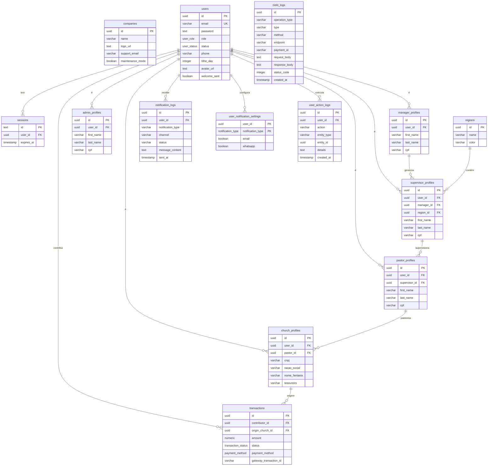

# 📄 Documentação do Banco de Dados - Vinha Admin Center

## 🏛️ Filosofia de Design

- **Centralização:** A tabela `companies` é a raiz de todos os dados
- **Relacional:** Chaves estrangeiras garantem integridade
- **Segurança:** UUIDs e senhas com hash (bcrypt)
- **Auditoria:** Soft delete em tabelas críticas (`deletedAt`, `deletedBy`, `deletionReason`)

---

## 🗂️ Diagrama de Relacionamentos (ERD)



## 📖 Tabelas Principais

### `companies`
Organização principal do sistema.

| Coluna             | Tipo      | Descrição                    |
| ------------------ | --------- | ---------------------------- |
| `id` (PK)          | `uuid`    | Identificador único          |
| `name`             | `varchar` | Nome da organização          |
| `logo_url`         | `text`    | URL do logo                  |
| `support_email`    | `varchar` | Email de suporte             |
| `maintenance_mode` | `boolean` | Modo de manutenção ativo     |

### `users`
Tabela central de autenticação e identificação.

| Coluna        | Tipo          | Descrição                                    |
| ------------- | ------------- | -------------------------------------------- |
| `id` (PK)     | `uuid`        | Identificador único                          |
| `email` (UK)  | `varchar`     | Email de login (único)                       |
| `password`    | `text`        | Senha com hash bcrypt                        |
| `role`        | `user_role`   | Perfil: admin, manager, supervisor, etc.     |
| `status`      | `user_status` | Status: active, inactive                     |
| `phone`       | `varchar`     | Telefone principal                           |
| `tithe_day`   | `integer`     | Dia preferencial do dízimo (1-31)            |
| `avatar_url`  | `text`        | URL do avatar (S3)                           |
| `welcome_sent`| `boolean`     | Controle de email de boas-vindas             |

### `sessions`
Sessões de login gerenciadas pelo Lucia Auth.

| Coluna       | Tipo        | Descrição                |
| ------------ | ----------- | ------------------------ |
| `id` (PK)    | `text`      | ID da sessão             |
| `user_id`    | `uuid`      | Referência ao usuário    |
| `expires_at` | `timestamp` | Data de expiração        |

### `regions`
Regiões geográficas para organização.

| Coluna    | Tipo      | Descrição                      |
| --------- | --------- | ------------------------------ |
| `id` (PK) | `uuid`    | Identificador único            |
| `name`    | `varchar` | Nome da região                 |
| `color`   | `varchar` | Cor hexadecimal (#RRGGBB)      |

### Tabelas de Perfis

Cada perfil tem sua própria tabela vinculada a `users`:

- **`admin_profiles`**: Administradores do sistema
- **`manager_profiles`**: Gerentes de rede
- **`supervisor_profiles`**: Supervisores regionais (vinculados a `manager` e `region`)
- **`pastor_profiles`**: Pastores (vinculados a `supervisor`)
- **`church_profiles`**: Igrejas (CNPJ, razão social, tesoureiro)

Campos comuns: `first_name`, `last_name`, `cpf`/`cnpj`, endereço completo (CEP, estado, cidade, bairro, endereço, número, complemento), redes sociais (Facebook, Instagram, Website).

### `transactions`
Registro de todas as transações financeiras.

| Coluna                    | Tipo                 | Descrição                              |
| ------------------------- | -------------------- | -------------------------------------- |
| `id` (PK)                 | `uuid`               | Identificador único                    |
| `contributor_id` (FK)     | `uuid`               | Usuário que contribuiu                 |
| `origin_church_id` (FK)   | `uuid`               | Igreja de origem (opcional)            |
| `amount`                  | `numeric`            | Valor da transação                     |
| `status`                  | `transaction_status` | approved, pending, denied, etc.        |
| `payment_method`          | `payment_method`     | pix, credit_card, boleto               |
| `gateway_transaction_id`  | `varchar`            | ID da transação no gateway (Cielo)     |

### `gateway_configurations`
Configurações de gateways de pagamento (Cielo, Bradesco).

| Coluna                     | Tipo      | Descrição                                |
| -------------------------- | --------- | ---------------------------------------- |
| `id` (PK)                  | `uuid`    | Identificador único                      |
| `gateway_name`             | `varchar` | Nome do gateway (Cielo, Bradesco)        |
| `is_active`                | `boolean` | Gateway ativo                            |
| `environment`              | `varchar` | production ou development                |
| `prod_client_id`           | `text`    | MerchantId de produção                   |
| `prod_client_secret`       | `text`    | MerchantKey de produção                  |
| `dev_client_id`            | `text`    | MerchantId de desenvolvimento            |
| `dev_client_secret`        | `text`    | MerchantKey de desenvolvimento           |
| `accepted_payment_methods` | `text`    | Métodos aceitos (JSON)                   |

### `other_settings`
Configurações gerais do sistema (SMTP, WhatsApp, S3).

| Coluna                  | Tipo      | Descrição                        |
| ----------------------- | --------- | -------------------------------- |
| `smtp_host`             | `varchar` | Servidor SMTP                    |
| `smtp_port`             | `integer` | Porta SMTP                       |
| `smtp_user`             | `varchar` | Usuário SMTP                     |
| `smtp_pass`             | `text`    | Senha SMTP                       |
| `whatsapp_api_url`      | `text`    | URL da Evolution API             |
| `whatsapp_api_key`      | `text`    | Chave da Evolution API           |
| `whatsapp_api_instance` | `varchar` | Instância do WhatsApp            |
| `s3_endpoint`           | `text`    | Endpoint S3 (AWS/MinIO)          |
| `s3_bucket`             | `varchar` | Nome do bucket                   |
| `s3_region`             | `varchar` | Região AWS                       |
| `s3_cloudfront_url`     | `text`    | URL do CloudFront (opcional)     |

### `notification_rules`
Regras de notificações automáticas.

| Coluna               | Tipo                          | Descrição                                  |
| -------------------- | ----------------------------- | ------------------------------------------ |
| `id` (PK)            | `uuid`                        | Identificador único                        |
| `name`               | `varchar`                     | Nome da regra                              |
| `event_trigger`      | `notification_event_trigger`  | user_registered, payment_received, etc.    |
| `days_offset`        | `integer`                     | Dias antes/depois do evento                |
| `message_template`   | `text`                        | Template da mensagem                       |
| `send_via_email`     | `boolean`                     | Enviar por email                           |
| `send_via_whatsapp`  | `boolean`                     | Enviar por WhatsApp                        |
| `is_active`          | `boolean`                     | Regra ativa                                |

### `message_templates`
Templates de mensagens personalizáveis.

| Coluna                   | Tipo      | Descrição                        |
| ------------------------ | --------- | -------------------------------- |
| `id` (PK)                | `uuid`    | Identificador único              |
| `template_type`          | `varchar` | Tipo do template                 |
| `name`                   | `varchar` | Nome do template                 |
| `whatsapp_template`      | `text`    | Template para WhatsApp           |
| `email_subject_template` | `varchar` | Assunto do email                 |
| `email_html_template`    | `text`    | HTML do email                    |
| `is_active`              | `boolean` | Template ativo                   |

### `notification_logs`
Logs de notificações enviadas (auditoria e deduplicação).

| Coluna               | Tipo        | Descrição                        |
| -------------------- | ----------- | -------------------------------- |
| `id` (PK)            | `uuid`      | Identificador único              |
| `user_id` (FK)       | `uuid`      | Usuário que recebeu              |
| `notification_type`  | `varchar`   | Tipo da notificação              |
| `channel`            | `varchar`   | email ou whatsapp                |
| `status`             | `varchar`   | sent, failed                     |
| `message_content`    | `text`      | Conteúdo enviado                 |
| `error_message`      | `text`      | Mensagem de erro (se falhou)     |
| `sent_at`            | `timestamp` | Data/hora do envio               |

### `user_notification_settings`
Preferências de notificação por usuário.

| Coluna              | Tipo                | Descrição                    |
| ------------------- | ------------------- | ---------------------------- |
| `user_id` (PK)      | `uuid`              | Usuário                      |
| `notification_type` | `notification_type` | Tipo de notificação          |
| `email`             | `boolean`           | Receber por email            |
| `whatsapp`          | `boolean`           | Receber por WhatsApp         |

### `user_action_logs`
Auditoria de ações dos usuários.

| Coluna        | Tipo        | Descrição                        |
| ------------- | ----------- | -------------------------------- |
| `id` (PK)     | `uuid`      | Identificador único              |
| `user_id`     | `uuid`      | Usuário que executou a ação      |
| `action`      | `varchar`   | Ação executada                   |
| `entity_type` | `varchar`   | Tipo de entidade afetada         |
| `entity_id`   | `uuid`      | ID da entidade                   |
| `details`     | `text`      | Detalhes adicionais (JSON)       |
| `created_at`  | `timestamp` | Data/hora da ação                |

### `cielo_logs`
Logs de requisições e respostas da API Cielo.

| Coluna           | Tipo        | Descrição                                |
| ---------------- | ----------- | ---------------------------------------- |
| `id` (PK)        | `uuid`      | Identificador único                      |
| `operation_type` | `varchar`   | pix, cartao, boleto, webhook, consulta   |
| `type`           | `varchar`   | request ou response                      |
| `method`         | `varchar`   | POST, GET                                |
| `endpoint`       | `varchar`   | URL do endpoint                          |
| `payment_id`     | `varchar`   | PaymentId da Cielo                       |
| `request_body`   | `text`      | JSON da requisição                       |
| `response_body`  | `text`      | JSON da resposta                         |
| `status_code`    | `integer`   | HTTP status code                         |
| `error_message`  | `text`      | Mensagem de erro (se houver)             |
| `created_at`     | `timestamp` | Data/hora do log                         |

### `webhooks`
Webhooks para integração com sistemas externos.

| Coluna      | Tipo            | Descrição                    |
| ----------- | --------------- | ---------------------------- |
| `id` (PK)   | `uuid`          | Identificador único          |
| `url`       | `text`          | URL do webhook               |
| `secret`    | `text`          | Secret para validação        |
| `events`    | `webhook_event` | Eventos que disparam         |
| `is_active` | `boolean`       | Webhook ativo                |

### `api_keys`
Chaves de API para acesso externo.

| Coluna         | Tipo             | Descrição                |
| -------------- | ---------------- | ------------------------ |
| `id` (PK)      | `uuid`           | Identificador único      |
| `name`         | `varchar`        | Nome da chave            |
| `key` (UK)     | `varchar`        | Chave de API (única)     |
| `status`       | `api_key_status` | active, inactive         |
| `last_used_at` | `timestamp`      | Último uso               |

---

## 🔄 Comandos de Gerenciamento

```bash
npm run db:generate  # Gerar migração
npm run db:push      # Aplicar no banco
npm run db:seed      # Popular com dados de teste
npm run db:studio    # Interface visual
npm run db:kill      # Apagar tudo (CUIDADO!)
```

---

**Última Atualização:** Janeiro 2025
