# 📄 Documentação do Banco de Dados - Vinha Admin Center

Este documento fornece uma visão detalhada da arquitetura, do esquema e dos relacionamentos do banco de dados PostgreSQL que serve como base para a aplicação Vinha Admin Center.

## 🏛️ Filosofia de Design

A estrutura do banco de dados foi projetada com os seguintes princípios em mente:

- **Centralização:** A tabela `companies` atua como a raiz de todos os dados, permitindo uma arquitetura multitenant no futuro.
- **Relacional:** As tabelas são interconectadas usando chaves estrangeiras, garantindo a integridade dos dados e permitindo consultas complexas.
- **Segurança:** O uso de UUIDs para chaves primárias e o armazenamento de senhas com hash (bcrypt) são práticas adotadas para proteger os dados.
- **Auditoria:** O "soft delete" (exclusão lógica) foi implementado em tabelas críticas para que os registros nunca sejam perdidos permanentemente, permitindo auditoria e recuperação.

---

## Diagrama de Entidade-Relacionamento (ER)

O diagrama abaixo ilustra as principais tabelas e seus relacionamentos.

```mermaid
erDiagram
    companies {
        UUID id PK "Chave Primária"
        varchar name "Nome da Empresa"
        text logo_url
        varchar support_email
        boolean maintenance_mode
    }

    users {
        UUID id PK "Chave Primária"
        UUID companyId FK "Ref: companies.id"
        varchar email UK "E-mail único"
        text password "Senha em hash"
        user_role role "Perfil do usuário"
        user_status status "Status (ativo, inativo)"
        varchar phone
        integer tithe_day "Dia do Dízimo"
    }

    sessions {
        text id PK "ID da Sessão"
        UUID userId FK "Ref: users.id"
        timestamp expires_at "Data de Expiração"
    }

    regions {
        UUID id PK "Chave Primária"
        UUID companyId FK "Ref: companies.id"
        varchar name
        varchar color
    }

    admin_profiles {
        UUID id PK
        UUID userId FK "Ref: users.id"
        varchar first_name
        varchar cpf UK
    }

    manager_profiles {
        UUID id PK
        UUID userId FK "Ref: users.id"
        varchar first_name
        varchar cpf UK
    }

    supervisor_profiles {
        UUID id PK
        UUID userId FK "Ref: users.id"
        UUID managerId FK "Ref: users.id (manager)"
        UUID regionId FK "Ref: regions.id"
        varchar first_name
        varchar cpf UK
    }

    pastor_profiles {
        UUID id PK
        UUID userId FK "Ref: users.id"
        UUID supervisorId FK "Ref: users.id (supervisor)"
        varchar first_name
        varchar cpf UK
    }

    church_profiles {
        UUID id PK
        UUID userId FK "Ref: users.id"
        UUID supervisorId FK "Ref: users.id (supervisor)"
        varchar cnpj UK
        varchar nome_fantasia
    }

    transactions {
        UUID id PK
        UUID companyId FK "Ref: companies.id"
        UUID contributorId FK "Ref: users.id"
        UUID originChurchId FK "Ref: users.id (church)"
        decimal amount
        transaction_status status
    }

    api_keys {
        UUID id PK
        UUID companyId FK "Ref: companies.id"
        varchar name
        varchar key UK
        api_key_status status
    }

    webhooks {
        UUID id PK
        UUID companyId FK "Ref: companies.id"
        text url
        text secret
        webhook_event events
    }

    notification_rules {
        UUID id PK
        UUID companyId FK "Ref: companies.id"
        varchar name
        notification_event_trigger event_trigger
        text message_template
    }

    gateway_configurations {
        UUID id PK
        UUID companyId FK "Ref: companies.id"
        varchar gateway_name
        boolean is_active
    }

    other_settings {
        UUID id PK
        UUID companyId FK "Ref: companies.id (unique)"
        varchar smtp_host
        varchar whatsapp_api_url
        varchar s3_endpoint
    }

    companies ||--o{ users : "possui"
    companies ||--o{ regions : "possui"
    companies ||--o{ transactions : "registra"
    companies ||--o{ api_keys : "gera"
    companies ||--o{ webhooks : "configura"
    companies ||--o{ notification_rules : "define"
    companies ||--o{ gateway_configurations : "configura"
    companies ||--|{ other_settings : "tem"

    users ||--o{ sessions : "tem"
    users ||--|{ admin_profiles : "é um"
    users ||--|{ manager_profiles : "é um"
    users ||--|{ supervisor_profiles : "é um"
    users ||--|{ pastor_profiles : "é um"
    users ||--|{ church_profiles : "é uma"

    users o|--o{ supervisor_profiles : "gerencia (manager)"
    users o|--o{ pastor_profiles : "supervisiona"
    users o|--o{ church_profiles : "supervisiona"
    users o|--o{ transactions : "realiza (contributor)"

    regions ||--o{ supervisor_profiles : "agrupa"

```

---

## 📖 Dicionário de Tabelas

A seguir, uma descrição detalhada de cada tabela principal do sistema.

### `companies`

A tabela raiz que armazena as informações da organização principal.

| Coluna             | Tipo      | Descrição                                        |
| ------------------ | --------- | ------------------------------------------------ |
| `id` (PK)          | `uuid`    | Identificador único para a empresa.              |
| `name`             | `varchar` | Nome oficial da organização.                     |
| `logo_url`         | `text`    | URL para a imagem do logo.                       |
| `support_email`    | `varchar` | E-mail de contato para suporte.                  |
| `maintenance_mode` | `boolean` | Flag para ativar/desativar o modo de manutenção. |

### `users`

Tabela central para todos os tipos de usuários, responsável pela autenticação e identificação.

| Coluna       | Tipo          | Descrição                                                        |
| ------------ | ------------- | ---------------------------------------------------------------- |
| `id` (PK)    | `uuid`        | Identificador único para cada usuário.                           |
| `email` (UK) | `varchar`     | E-mail de login, deve ser único.                                 |
| `password`   | `text`        | Senha do usuário, armazenada com hash bcrypt.                    |
| `role`       | `user_role`   | Enum que define o perfil: `admin`, `manager`, `supervisor`, etc. |
| `status`     | `user_status` | Enum que define o status do usuário: `active`, `inactive`, etc.  |
| `phone`      | `varchar`     | Número de telefone principal do usuário.                         |
| `tithe_day`  | `integer`     | Dia preferencial para a contribuição do dízimo (1 a 31).         |

### `*_profiles`

As tabelas de perfil (`admin_profiles`, `manager_profiles`, etc.) armazenam dados específicos de cada tipo de usuário e se relacionam com a tabela `users` através do `userId`. Elas contêm informações como nome, CPF/CNPJ, endereço e outras configurações particulares de cada perfil.

### `regions`

Armazena as regiões geográficas ou lógicas usadas para organizar supervisores, pastores e igrejas.

| Coluna    | Tipo      | Descrição                                               |
| --------- | --------- | ------------------------------------------------------- |
| `id` (PK) | `uuid`    | Identificador único da região.                          |
| `name`    | `varchar` | Nome da região (ex: "Sudeste", "Região Missionária 1"). |
| `color`   | `varchar` | Cor hexadecimal (`#RRGGBB`) para identificação visual.  |

### `transactions`

Registra todas as transações financeiras realizadas na plataforma.

| Coluna                  | Tipo                 | Descrição                                                          |
| ----------------------- | -------------------- | ------------------------------------------------------------------ |
| `id` (PK)               | `uuid`               | Identificador único da transação.                                  |
| `contributor_id` (FK)   | `uuid`               | ID do usuário que realizou a contribuição.                         |
| `origin_church_id` (FK) | `uuid`               | ID da igreja de onde partiu a contribuição (se aplicável).         |
| `amount`                | `numeric`            | Valor da transação.                                                |
| `status`                | `transaction_status` | Enum que define o estado do pagamento: `approved`, `pending`, etc. |
| `payment_method`        | `payment_method`     | Enum do método usado: `pix`, `credit_card`, `boleto`.              |

### `sessions`

Tabela gerenciada pelo Lucia Auth para armazenar as sessões de login ativas dos usuários.

### `gateway_configurations` e `other_settings`

Armazenam as configurações de serviços externos, como credenciais de gateways de pagamento (Cielo, Bradesco), SMTP para envio de e-mails, e armazenamento de objetos (S3).

### `api_keys` e `webhooks`

Tabelas essenciais para a integração com sistemas de terceiros, permitindo acesso seguro à API e o envio de notificações de eventos para URLs externas.

---

Esta documentação deve ser mantida atualizada para refletir quaisquer mudanças no `schema.ts`.
